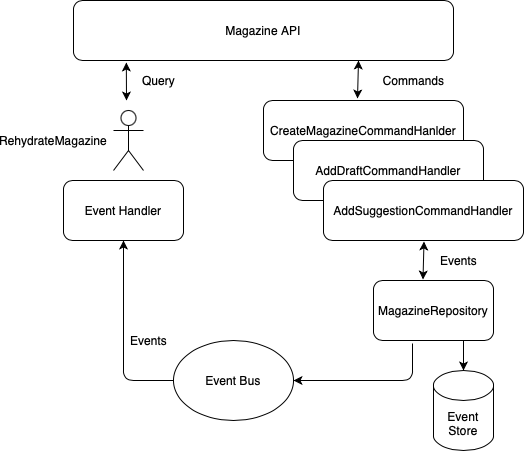

# Magazine

For the design of Magazine I used Hexagonal + DDD + CQRS + Event Sourcing, I will explain a little bit why the use of these three architectures patters.

## Hexagonal

It helps to decouple the different layers of your service(Application, Domain, Infrastructure) making it more extensible and easy to port each of the layers into another program if it's needed.

In Magazine I implemented three modules described like:

* ```Application```: Layer which normally is the entry point of your app. It has dependency with domain and infrastructure modules.
* ```Domain```: Layer where you implement the business logic of your application. It does not have any dependency.
* ```Infrastructure```: Layer where you implement the communication with the backends (Database, Bus). It has dependency with domain.


## DDD

Domain Driven Design it's a design pattern for dealing with highly complex domains that is based on making the domain itself the main focus of the project.


## CQRS

Command Query Responsibility Segregation it's another Architecture pattern, mostly divulged by **Greg Young** which segregate the model of Commands and Queries
in your architecture to do Writes and Reads separated. It can give you the chance to make the Queries more efficient since normally in a Cluster the 90% of the traffic
is for Queries.
 
In Magazine I implemented CommandHandlers for each Commands and EventHandler to deal with Queries.

* ```CommandHandlers```: Receives commands and transforms the Command into Events, to be passed into the infrastructure,
  where is persisted and sent to the ```EventBus``` to be consumed by ```EventHandler```.
* ```EventHandler```: It's subscribed to the ```EventBus``` and each time we receive a ```MagazineEvent```
  we rehydrate the Magazine actor. 
  
    Then once we receive a **Query** and we render the Magazine with the latest state.




## Event Sourcing

Event sourcing is another Architecture pattern where you work with Events. The main idea of Event sourcing is to keep and persist the state of your program, without mutating previous states.

That means that with Event sourcing I'm not deleting any data in the system, giving us the possibility to have an historical about the different state of one Magazine.

In Magazine, Event sourcing together with CQRS, allow us persist events in order to keep state and have historical data.

* ```MagazineCreatedEvent```: Event that keep the state of the creation of a magazine.
* ```ArticleDraftCreatedEvent```: Event that keep the state of the add draft article in the magazine.
* ```SuggestionAddedEvent```: Event that keep the state of the add suggestion into the article.

## Testing


**To go fast you have to go well** this quote of Robert C. Martin express perfectly what TDD and BDD is. You should think first in all corner cases of your program, and then implement
one by one committing every scenario to have a quick feedback about your program.

In our application I invested mostly of the time implementing the test framework, the type of testing implemented are described below.

* ```Unit```: I used JUnit together with Mockito to Mock external resources of your class.
* ```Integration```: I used **process-exec-maven-plugin** plugin, to run the jar with all the classpath dependencies, 
and then using JUnit we run the test against the endpoints of the service, to prove the end to end works as we expect.